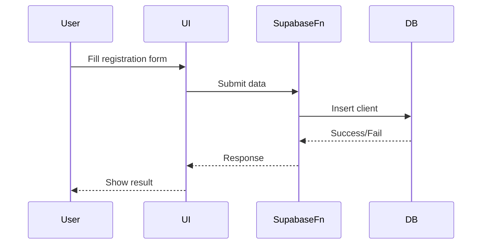
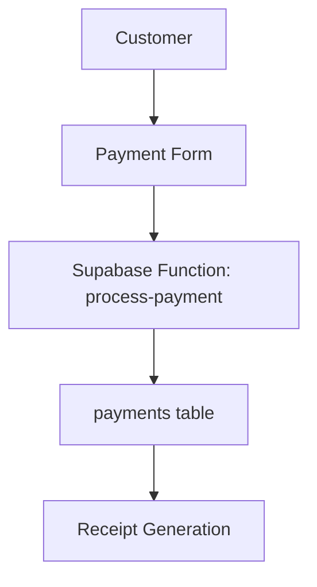
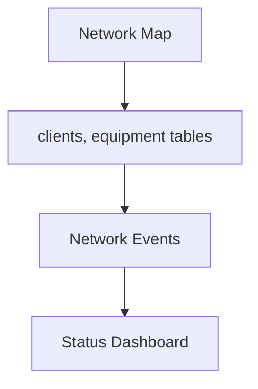
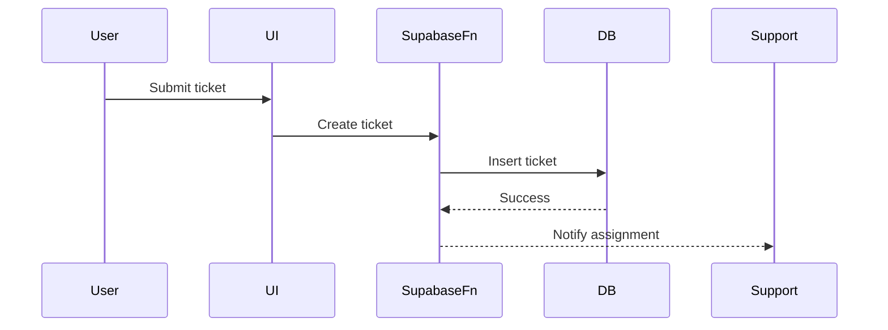

# ISP Management System Manual

---

## Table of Contents

- [System Access](#system-access)
- [Department Roles](#department-roles)
- [Department User Manuals](#department-user-manuals)
  - [Customers](#customers)
  - [Billing & Payments](#billing--payments)
  - [Network Management](#network-management)
  - [Support & Ticketing](#support--ticketing)
  - [Equipment & Inventory](#equipment--inventory)
  - [Hotspots & Roaming](#hotspots--roaming)
  - [Admin/User Management](#adminuser-management)
  - [Settings](#settings)
- [System Operations](#system-operations)
- [Technical Specifications & Configuration](#technical-specifications--configuration)

---

## System Access

### User Types (Roles)
- **Super Admin:** Full access to all system features and settings.
- **Admin:** Access to most features, limited settings.
- **Support:** Handles tickets and knowledge base.
- **Billing/Finance:** Manages invoices, payments, receipts.
- **Customer:** Self-service, support, payments.

### How to Log In/Out
1. **Access the Login Page:**
   - Go to the system URL (e.g., `http://localhost:5173` or your deployed domain).
   - 
2. **Enter Credentials:**
   - Input your email and password.
   - Click **Login**.
3. **Logout:**
   - Click your profile/avatar in the top right.
   - Select **Logout**.

### Navigation Overview
- **Sidebar:** Main navigation for departments (Dashboard, Customers, Billing, etc.).
- **Top Bar:** User profile, notifications, quick actions.
- **Dashboard:** Landing page after login, with quick stats and links.

---

## Department Roles

### Role Matrix

| Department         | Super Admin | Admin | Support | Billing/Finance | Customer |
|-------------------|:-----------:|:-----:|:-------:|:---------------:|:--------:|
| Customers         |     ✓       |   ✓   |         |                 |    ✓     |
| Billing/Payments  |     ✓       |   ✓   |         |        ✓        |    ✓     |
| Network Mgmt      |     ✓       |   ✓   |         |                 |          |
| Support/Ticketing |     ✓       |   ✓   |    ✓    |                 |    ✓     |
| Equipment/Inv.    |     ✓       |   ✓   |         |                 |          |
| Hotspots/Roaming  |     ✓       |   ✓   |         |                 |    ✓     |
| Admin Mgmt        |     ✓       |   ✓   |         |                 |          |
| Settings          |     ✓       |   ✓   |         |                 |          |

### Responsibilities
- **Super Admin:** System setup, user management, all settings.
- **Admin:** Daily operations, department oversight.
- **Support:** Handle tickets, update knowledge base.
- **Billing/Finance:** Invoice generation, payment tracking.
- **Customer:** Register, manage account, make payments, request support.

---

## Department User Manuals

### Customers

#### Purpose
Register new customers, manage profiles, view/edit details.

#### How to Register as a Customer
1. Go to the **Customer Portal**.
   - 
2. Click **Register Now**.
3. Fill in the registration form (personal, location, service info).
   - 
4. Submit the form. You'll receive a confirmation.

#### How Admins Manage Customers
1. Go to **Customers** in the sidebar.
2. View the list, search, or filter customers.
3. Click a customer to view or edit details.
   - 

#### Common Workflows
- **Edit Profile:** Click edit on a customer's profile, update info, save.
- **Assign Equipment:** From customer details, assign equipment as needed.

#### Diagram: Customer Registration


---

### Billing & Payments

#### Purpose
Generate/manage invoices, track payments, export/view receipts.

#### How to View/Pay Invoices (Customer)
1. Log in and go to **Billing**.
2. View your invoice list.
   - 
3. Click **Pay** on an invoice.
4. Choose payment method (M-Pesa, wallet, etc.).
   - 
5. Follow on-screen instructions to complete payment.

#### How Admins Generate Invoices
1. Go to **Billing** > **Generate Invoice**.
2. Select customer, enter amount, due date.
3. Click **Generate**.

#### How to View Receipts
- Go to **Receipts** in Billing.
- Download or print as needed.

#### Diagram: Payment Flow


---

### Network Management

#### Purpose
Visualize/manage network infrastructure, monitor status/events.

#### How to Use the Network Map
1. Go to **Network Management**.
2. View the map with client/equipment markers.
   - 
3. Use filters to show/hide layers (clients, equipment, outages).
4. Click markers for more info.

#### How to Monitor Network Status
- Use the **Status Dashboard** for real-time updates.
- Review alerts and notifications.

#### Diagram: Network Status Flow


---

### Support & Ticketing

#### Purpose
Manage support tickets, track SLAs/escalations, knowledge base.

#### How to Submit a Ticket (Customer)
1. Go to **Support**.
2. Click **Create Ticket**.
3. Fill in the issue details, attach files if needed.
4. Submit. Track status in your ticket list.
   - 

#### How Support Staff Handle Tickets
1. Go to **Support** > **Tickets**.
2. Filter by status, priority, or department.
3. Click a ticket to view, comment, or resolve.
4. Use **Escalate** if needed.

#### Diagram: Ticket Escalation


---

### Equipment & Inventory

#### Purpose
Manage equipment/inventory, assign to clients/locations.

#### How to Add Inventory
1. Go to **Inventory**.
2. Click **Add Item**.
3. Enter item details, save.
   - 

#### How to Assign Equipment
1. From inventory or customer details, click **Assign Equipment**.
2. Select equipment and target (client/location).
3. Confirm assignment.

---

### Hotspots & Roaming

#### Purpose
Manage WiFi hotspots, monitor sessions/analytics, generate vouchers.

#### How to Manage Hotspots
1. Go to **Hotspot Management**.
2. View list of hotspots, add/edit as needed.
   - 

#### How to Generate Vouchers
1. Go to **Voucher Management**.
2. Click **Generate Voucher**.
3. Set duration, usage limits, etc.
4. Print or export voucher codes.

---

### Admin/User Management

#### Purpose
Manage users/roles, control access/permissions.

#### How to Add a User
1. Go to **Admin/User Management**.
2. Click **Create User**.
3. Enter user details, assign role.
   - 
4. Save. User receives invite or credentials.

#### How to Change Roles
- Edit user and select new role from dropdown.

---

### Settings

#### Purpose
Configure API endpoints, feature toggles, system-wide settings.

#### How to Update Settings
1. Go to **Settings**.
2. Edit API URLs, keys, or feature toggles.
   - 
3. Save changes.

---

## System Operations

### Daily Tasks
- Review dashboard for alerts/notifications.
- Check new tickets and assign as needed.
- Monitor network status.
- Process new customer registrations.

### Weekly Tasks
- Review outstanding invoices/payments.
- Update knowledge base articles.
- Audit inventory and equipment assignments.

### Monthly Tasks
- Generate reports (billing, support, network uptime).
- Review user roles and permissions.
- Perform system backup/export.

### Reporting
- Use built-in analytics and export features in each department.
- Download CSV/PDF reports as needed.

### Troubleshooting (User-Level)
- **Can't log in?** Reset password or contact admin.
- **Payment not processing?** Check M-Pesa status, try again, or contact support.
- **Ticket not updated?** Refresh page or contact support.

---

## Technical Specifications & Configuration

### Tech Stack
- **Frontend:** React, TypeScript, Vite, TailwindCSS, Shadcn UI, Radix UI
- **Backend/API:** Supabase (Postgres, Edge Functions)
- **State Management:** React Context, custom hooks
- **Validation:** Zod, React Hook Form
- **Icons:** Lucide
- **Testing:** Jest, React Testing Library (recommended)

### Installation & Setup

#### Prerequisites
- Node.js (v18+)
- npm or bun
- Supabase account
- Git

#### Installation
```bash
git clone <repo-url>
cd main_isp_system
npm install
# or
bun install
```

#### Environment Configuration
- Create a `.env` file:
  ```
  VITE_SUPABASE_URL=your-supabase-url
  VITE_SUPABASE_ANON_KEY=your-supabase-anon-key
  ```
- Update `supabase/config.toml` as needed.

#### Running the App
```bash
npm run dev
# or
bun run dev
```

### Database & Migrations
- Migrations in `supabase/migrations/`.
- Apply with:
  ```bash
  supabase db push
  ```
- Create new migration:
  ```bash
  supabase migration new <migration-name>
  ```

### Supabase Edge Functions
- Business logic in `supabase/functions/`.
- Deploy with:
  ```bash
  supabase functions deploy
  ```

### Developer Notes
- Use strict TypeScript mode.
- Follow DRY, SOLID, and best practices.
- Use Tailwind for all styling.
- Use Shadcn UI and Radix for accessible components.
- Add/replace screenshot placeholders with real images for documentation.

---

**For more code samples, deeper workflow guides, or to add real screenshots, update the placeholders above.** 